# Deterministic PubMed Search — Architecture

How an exhaustive, **reproducible** literature search is built. The core idea:
the LLM is the *only* non-deterministic component and it merely **proposes**
structure — every proposal is resolved against a local, deterministic MeSH index
before it can affect the query. Given the same *selection*, the compiled PubMed
query is byte-identical, and we hash it.

How far that carries to "the same question always gives the same query" is a
measured quantity, not an assumption — see
**[Cross-model determinism](#cross-model-determinism-three-strategies-2026-08-10)**
for the numbers per strategy. Short version: without an LLM (`mesh_only`) it is
1.00; with one it is 0.90 within a model and ~0.8 across models under the hybrid
strategy, so a protocol still has to record the model and the strategy.

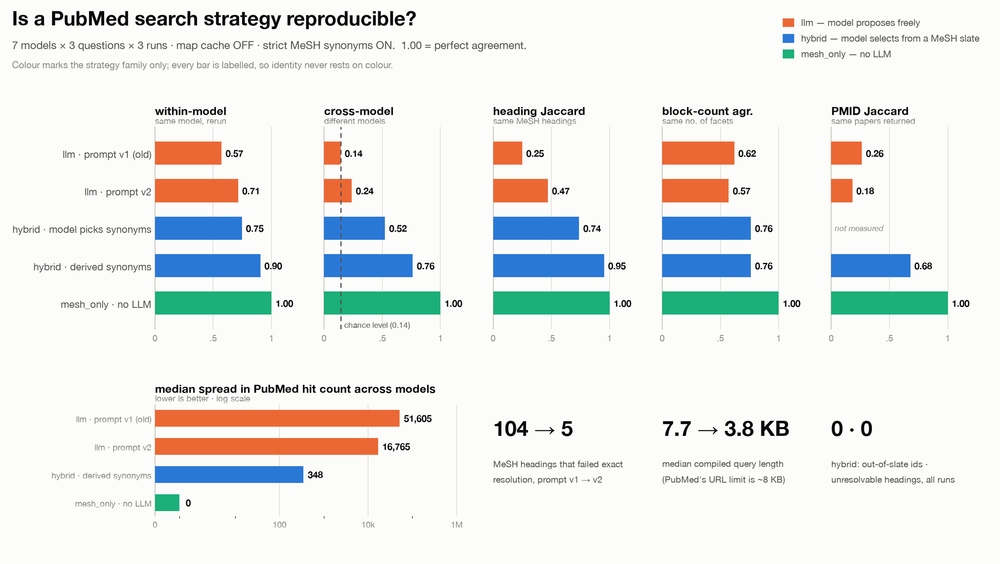

New to MeSH vocabulary (DUI, entry term, tree number, explosion) or to the terms
this document coins (slate, span group, facet closure)? The
**[Glossary](#glossary)** defines every one of them with a real example.

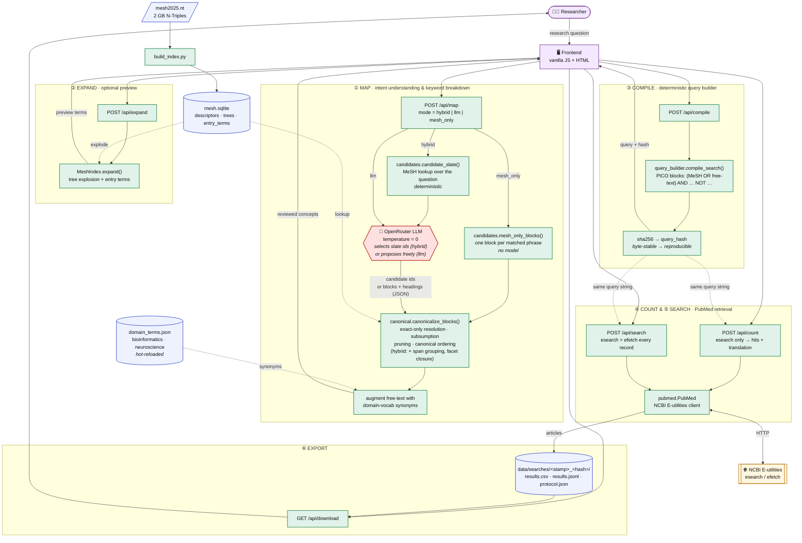

### The same flow in words

Each numbered stage above, what it does, and what it guarantees:

**① MAP — `POST /api/map` → `pipeline.build_async`.** Turns a question into concept
blocks. The only stage a model touches.

- `candidates.candidate_slate()` searches the **local** MeSH index for every phrase
  the question contains — longest match first, plus singular/plural and hyphen
  variants, hyphen-compound parts, reworded phrase matches, and each match's
  immediate broader term. Output is a *numbered* list of real descriptors.
- Depending on `mode`, the model then either **selects ids** from that list
  (`hybrid`), **proposes** blocks and headings from scratch (`llm`), or is not
  called at all (`mesh_only`, which makes one block per matched phrase).
- `canonical.canonicalize_blocks()` resolves each heading **exactly** (no fuzzy
  match reaches the query), drops headings a broader heading in the same block
  already explodes over, and sorts blocks and terms into a canonical order.
- In `hybrid`, two further deterministic rules apply: candidates from overlapping
  question words are grouped into one OR block (`span_groups`), and naming any
  member of a facet pulls in that facet's whole canonical vocabulary
  (`group_closure`).
- Domain-vocabulary synonyms matching the block's headings are attached.
- **Guarantee:** every heading in the response exists verbatim in MeSH; anything
  dropped is reported (unresolvable candidate, redundant heading, question phrase
  absent from MeSH) rather than silently discarded.

**② EXPAND — `POST /api/expand`.** Optional preview: shows a descriptor's full
exploded subtree and synonym set before you commit to it. Pure index lookup.

**③ COMPILE — `POST /api/compile` → `query_builder.compile_search`.** Concept blocks
(as reviewed and edited by you) become one Boolean string.

- With *strict* on, each block's free-text is re-derived from the MeSH index rather
  than model prose, bounded by `STRICT_MAX_TERMS`.
- Blocks are ANDed, terms inside a block ORed, inclusion filters wrapped with
  `AND`, exclusions with `NOT`, everything de-duplicated case-insensitively.
- **Guarantee:** byte-identical output for identical input, hashed with sha256 —
  that hash is the reproducibility key recorded in the protocol.

**④ COUNT — `POST /api/count`.** One `esearch` with `retmax=0`: how many hits, plus
PubMed's own translation of the query and any warnings (e.g. quoted phrases it could
not find). Cheap, so use it before committing to a full run.

**⑤ SEARCH — `POST /api/search` → `pubmed.fetch_query`.** Retrieves every record.

- Under 9,999 hits: one history-server walk (`esearch usehistory=y` → paged
  `efetch`).
- Above it: the query is split into publication-date slices (each ≤ 9,999) because
  NCBI refuses `retstart > 9998`; slices are walked separately and de-duplicated by
  PMID.
- **Guarantee:** results sorted by PMID, so two runs of the same query produce
  identical files; `records_unaccounted` states whether anything was missed.

**⑥ EXPORT — `data/searches/<time>_<hash>/`.** `results.csv`, `results.jsonl`, and
`protocol.json` (question, model, mode, strict flag, concepts, filters, query, hash,
count, date slices). That folder *is* the reproducibility artifact.

### A worked example

`"Does optogenetic stimulation of the hippocampus improve memory consolidation in
rodent models?"`, `hybrid` mode, `google/gemini-3.5-flash`, strict on — real output,
not illustrative:

**① The slate** — nine candidates, found without any model:

| id | descriptor | DUI | relation | from the words |
|---|---|---|---|---|
| 1 | Cerebral Cortex | D002540 | broader | "hippocampus" |
| 2 | Eutheria | D000073566 | broader | "rodent" |
| 3 | Genetic Techniques | D005821 | broader | "optogenetic" |
| 4 | **Hippocampus** | D006624 | exact | "hippocampus" |
| 5 | Limbic System | D008032 | broader | "hippocampus" |
| 6 | **Memory Consolidation** | D000069077 | exact | "memory consolidation" |
| 7 | Memory, Long-Term | D057567 | broader | "memory consolidation" |
| 8 | **Optogenetics** | D062308 | exact | "optogenetic" |
| 9 | **Rodentia** | D012377 | exact | "rodent" |

Unmatched phrases (free-text territory only): `stimulation`, `improve`.
Span groups — the OR blocks, decided by the question's words, not the model:
`{1,4,5}` from "hippocampus", `{2,9}` from "rodent", `{3,8}` from "optogenetic",
`{6,7}` from "memory consolidation".

**② The model's whole contribution** is choosing ids, and it said so:

> *"Dropped broader candidates 1, 2, 3, 5, and 7 because exact matches (4, 6, 8, 9)
> were available for all facets."*

Note what it could not do: invent a heading, put `Optogenetics` and `Hippocampus`
in the same OR block, or pick different synonyms inside a facet. Had it named only
the broader `Limbic System` (id 5), closure would have replaced it with
`Hippocampus` — the exact match from the same span.

**③ The blocks**, after canonicalisation, with strict free-text counts:

| slot | MeSH | free-text terms from the index |
|---|---|---|
| context | `Hippocampus` | 60 (`Ammon Horn`, `Cornu Ammonis`, `Subiculum`, … capped by `STRICT_MAX_TERMS`) |
| outcome | `Memory Consolidation` | 9 |
| intervention | `Optogenetics` | 12 |
| population | `Rodentia` | 60 |

**④ The compiled query** — 4 blocks, 145 terms, 5,500 characters,
hash `a4dc7474caa9b4b4`, **71** PubMed hits:

```
("Hippocampus"[MeSH Terms] OR "Ammon Horn"[Title/Abstract] OR "Ammon's Horn"[Title/Abstract]
 OR "Ammons Horn"[Title/Abstract] OR "Area Dentata"[Title/Abstract] OR … )
AND ("Memory Consolidation"[MeSH Terms] OR … )
AND ("Optogenetics"[MeSH Terms] OR … )
AND ("Rodentia"[MeSH Terms] OR … )
```

`"Hippocampus"[MeSH Terms]` alone already retrieves the 7 descendants PubMed has
indexed (`Dentate Gyrus`, `CA1 Region, Hippocampal`, `Schaffer Collaterals`, …) —
the `[Title/Abstract]` terms are there for records not yet MeSH-indexed.

**The punchline:** `mesh_only` on the same question compiles to the **same hash**,
`a4dc7474caa9b4b4`. When the question names its facets plainly, the model's
judgement and the deterministic baseline agree exactly — and when they don't, the
difference is a facet decision you can see and review, not a wording accident.

## The determinism boundary

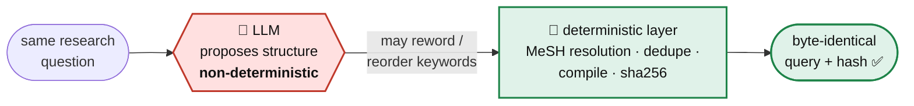

**How far this holds — and where it breaks.** The deterministic layer does real
work: a hallucinated MeSH heading resolves to *nothing* and drops out; terms are
lower-cased, de-duped, sorted; block/clause order is fixed. But we *measured* it
(`eval/determinism_eval.py`) and the naive pipeline is **not** reproducible:
`query_hash` determinism was ≈ **0.10** for most models in the first run (all 10
runs → 10 different queries). At `temperature=0` the LLM still emits a **different
set of free-text synonyms — and even a different set of MeSH headings — each
run**, and those flow straight into the query. The deterministic layer can't
absorb a changing *input set*.

Two sections follow, in the order the work happened:
**[Reproducibility in practice](#reproducibility-in-practice-measured--fixed)** —
the three mechanisms that fix the *within-model* case; and
**[Cross-model determinism](#cross-model-determinism-three-strategies-2026-08-10)**
— why those three are not enough across models, and the strategies that help.

## How MeSH is used

MeSH (Medical Subject Headings) is NLM's controlled vocabulary. It does two jobs
here: it **filters LLM hallucinations** (a proposed heading that isn't real
resolves to nothing) and it **drives exhaustive recall** (tree explosion + entry
terms). All of it is local and deterministic.

### 1 · Building the index (one-time, offline)

`mesh2025.nt` (2 GB N-Triples) is distilled into a small SQLite DB. Only
subjects that carry a `preferredConcept` are kept as descriptors — that filters
out tree-number nodes that share the `D…` prefix but aren't real headings.

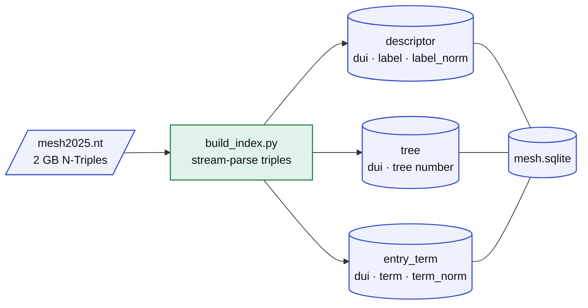

| Table | Columns | Purpose |
|-------|---------|---------|
| `descriptor` | `dui`, `label`, `label_norm` | the official heading (D-unique-id) |
| `tree` | `dui`, `tree` | hierarchy positions (e.g. `G11.427.590`) → explosion |
| `entry_term` | `dui`, `term`, `term_norm` | synonyms / variants → free-text recall |

### 2 · Resolving an LLM-proposed heading (`canonical.resolve_strict`)

Each candidate name from the LLM is normalized then matched in a fixed priority
order. A name that matches nothing simply **drops out** — that is the
hallucination filter.

> **Changed 2026-08-10.** The auto-accept path is now **exact-match only**
> (heading, then entry term). The substring tier below is still available to a
> *human* in the UI, but it no longer feeds the query on its own: it used to
> auto-select its first hit even when `matched=false`, which is how
> `"Ziekte, centraalzenuwstelsel-"[MeSH Terms]` — a Dutch label PubMed cannot
> match — reached a compiled query in the first evaluation.

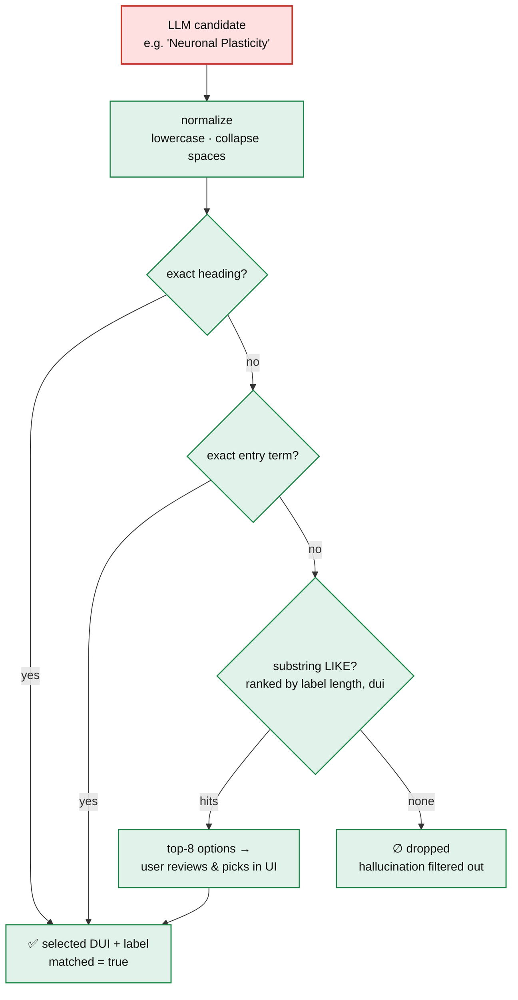

### 3 · Explosion + entry terms = exhaustive recall

The selected descriptor feeds two complementary recall paths that are ORed
inside its concept block:

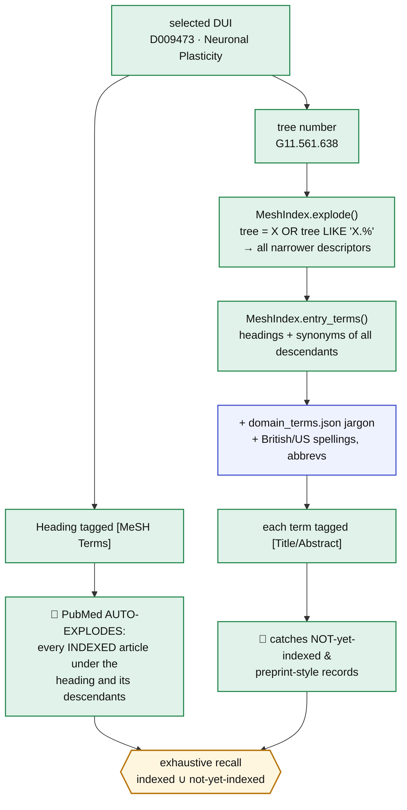

**The key insight:** `[MeSH Terms]` alone only finds articles NLM has already
manually indexed — which lags months behind publication and misses preprints. By
also injecting the exploded descendants' **entry terms** (plus domain jargon) as
`[Title/Abstract]`, the query reaches recent and not-yet-indexed records too.
That union is the "exhaustive" part, and because both halves come from the
deterministic index, the result is fully reproducible.

## Core algorithms

The system is a chain of small, deterministic algorithms wrapped around a single
LLM proposal step. Each one below is taken directly from the code.

### A · Index build — streaming N-Triples → SQLite  (`build_index.py`)

MeSH RDF is a 2 GB flat triple file; loading it into an RDF library is
unnecessary. Instead we stream it line-by-line and route each triple by the
**first letter of its subject** (`D`escriptor / `M` concept / `T` term),
reconstructing the `descriptor → concept → term → label` chain in memory, then
flushing to SQLite.

```text
for each line in mesh.nt:                       # ~ tens of millions, O(1) mem/line
    (subj, pred, obj, is_uri) = parse_ntriple(line)   # hand-rolled, no rdflib
    skip unless pred ∈ {label, treeNumber, concept, preferredConcept,
                        term, preferredTerm, prefLabel, altLabel}
    switch subj[0]:
        'D': record label / tree numbers / concept links for the descriptor
        'M': record term links for the concept
        'T': record synonym strings for the term

for each descriptor D with a (preferred) Concept:      # ← the key filter
    emit descriptor(D.dui, label, norm(label))
    emit tree(D.dui, t)            for t in D.tree_numbers
    synonyms = {D.label} ∪ {labels of every term of every concept of D}
    emit entry_term(D.dui, s, norm(s))  for s in synonyms
```

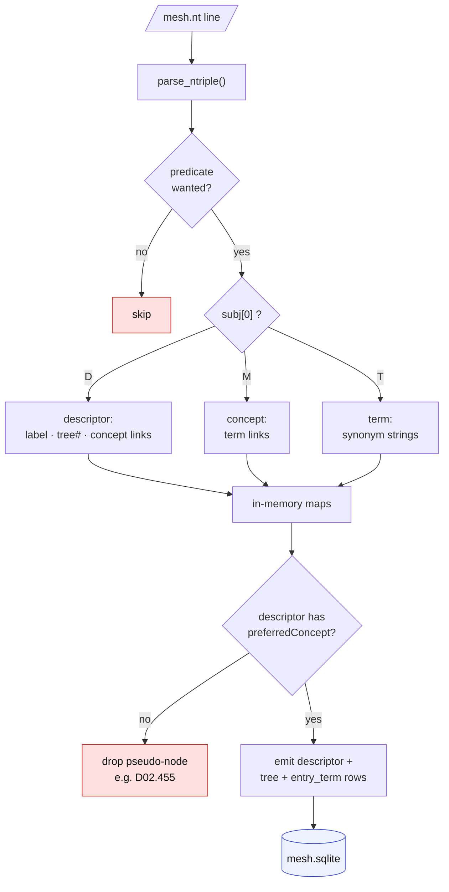

- **Why the "has a concept" filter?** Category-D tree nodes (e.g. `D02.455`) are
  also `D`-prefixed and carry an `rdfs:label`, but no `preferredConcept`.
  Requiring a concept drops those pseudo-descriptors — the gotcha that made
  early builds noisy.
- `norm(s)` = lowercase + whitespace-collapse, stored alongside the raw string
  so lookups are case/spacing-insensitive but display stays exact.

### B · Candidate resolution ladder  (`MeshIndex.search`)

Turns a free-text LLM suggestion into real descriptors via a fixed-priority
cascade; stops widening once it has enough. **Since 2026-08-10 tier 3 is
suggestions-only** — it populates the UI's picker for a human, while the query
itself is built by `canonical.resolve_strict`, which stops after tier 2.

```text
resolve(text, limit=8):
    seen = ordered-unique-by-DUI
    add  exact heading      WHERE label_norm = norm(text)          # tier 1
    add  exact entry term   WHERE term_norm  = norm(text)          # tier 2
    if |seen| < limit:
        add substring        WHERE label_norm LIKE '%norm(text)%'  # tier 3
             ORDER BY length(label), dui   LIMIT limit             # shortest first
    return seen[:limit]        #  ∅  ⇒ candidate was a hallucination, dropped
```

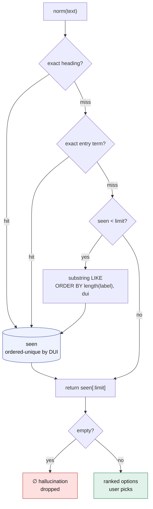

- Ordering is total and deterministic (`length(label), dui`), so the same
  suggestion always yields the same ranked options — no tie-break ambiguity.

### C · Tree explosion — dotted-prefix set union  (`MeshIndex.explode`)

MeSH "explode" = a heading plus everything hierarchically beneath it. Tree
numbers encode the hierarchy as dotted paths (`G11.561.638`), so descendants are
exactly the rows whose tree number equals or is prefixed by one of the seed's:

```text
explode(dui):
    found = {dui}
    for tn in tree_numbers(dui):
        found ∪= { d : tree(d) = tn  OR  tree(d) LIKE tn || '.%' }
    return sorted(found)          # stable
```

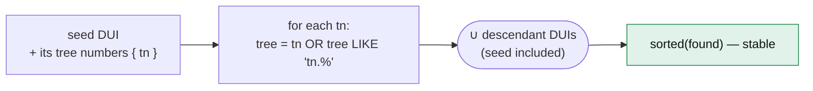

- Purely relational; no recursion needed because the dotted path *is* the
  ancestry. `A01` → `A01`, `A01.111`, `A01.923.047`, …

### D · Deterministic query compilation + hash  (`query_builder`)

Concept blocks compile to a canonical Boolean string. Determinism comes from:
order-preserving case-insensitive de-dup, fixed clause order, and consistent
quoting.

```text
block(concept)  = "(" + OR_join(
                      [ q(h)+MeSH-tag       for h in dedupe(concept.mesh) ] +
                      [ q(t)+"[Title/Abstract]" for t in dedupe(concept.freetext) ]
                  ) + ")"

query = AND_join(non-empty blocks)                       # PICO: blocks ANDed
for clause in [date, languages, pub-types, species, custom_include]:
    query = "(query) AND clause"                         # inclusion filters
for clause in [exclude pub-types, exclude terms, custom_exclude]:
    query = "(query) NOT clause"                         # exclusions
hash  = sha256(query)[:16]                               # reproducibility key
```


- `dedupe` keeps first occurrence, compares on `strip().lower()` → stable set,
  stable order. Same inputs ⇒ byte-identical `query` ⇒ identical `hash`. This is
  the invariant `eval/determinism_eval.py` measures as `query_hash` determinism.

### E · Exhaustive retrieval — history server, paging, and the 9,999 ceiling  (`pubmed.PubMed`)

To pull *every* match with no silent cap, we use the E-utilities history server:
one `esearch` stores the full result set server-side (`WebEnv` + `query_key`),
then `efetch` pages through it.

> **NCBI's hard limit (found 2026-08-11 by a crash).** Quoting the efetch error:
> *"'retstart' cannot be larger than 9998. For PubMed, ESearch can only retrieve
> the first 9,999 records matching the query."* So the history walk **cannot** reach
> record 10,000 — a search returning 35,089 hits died with `400 Bad Request` from
> efetch partway through, and the PMID-list helper used by the evaluation silently
> returned 9,999 of 35,089 with no error at all. Which was worse: a crash is
> visible, a truncated "exhaustive" search is not.
>
> The fix is what NCBI's own EDirect does internally — **split the query until each
> piece fits**. `date_partitions()` bisects the publication-date range, re-counting
> each half, until every slice is ≤ 9,999; `fetch_query()` then walks each slice and
> de-duplicates by PMID. For `"Microglia"[MeSH Terms]` (35,089 records) that is 7
> slices from 1896 to 2028, all under the ceiling.
>
> Two details worth knowing. Slice counts can **overlap** — a record carrying both a
> print and an electronic publication date matches two adjacent slices — so the
> completeness check is the de-duplicated PMID count, not the sum of slice counts.
> And every saved `protocol.json` now records the slices plus
> `records_unaccounted` (`total − unique fetched`, which should be 0), so a
> shortfall is auditable rather than invisible.

```text
fetch_query(query, max_records?):
    total = count(query)
    slices = [query]                     if total <= 9999
             date_partitions(query)      otherwise   # bisect PDAT until each <= 9999
    for slice in slices:
        {count, WebEnv, query_key} = esearch(slice, usehistory=y)
        for start in 0, 500, 1000, … < min(count, room):
            articles += parse(efetch(WebEnv, query_key, retstart=start, retmax=500))
    dedupe by pmid; sort by int(pmid)     # stable regardless of slicing or NCBI paging
    missing = total - len(unique)         # 0 on an uncapped run, else surfaced

date_partitions(query, limit=9999):      # deterministic, complete
    rec(a, b): n = count(query AND [a:b][Date - Publication])
               n == 0        → []
               n <= limit    → [(a, b, n)]
               a == b        → [(a, b, n, truncated)]     # a single day over 9,999
               else          → rec(a, mid) + rec(mid+1, b)
```

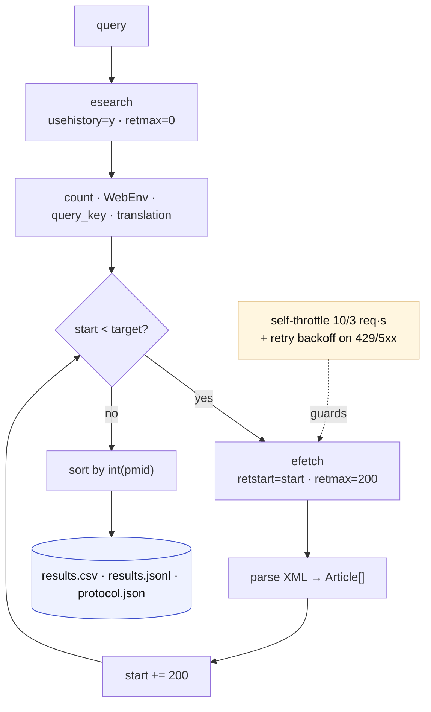

- **Self-throttle** to NCBI limits (10 req/s with key, else 3) and **retry with
  linear backoff** on 429/5xx. Result order is normalized by PMID so two runs
  produce identical files.

### F · Determinism scoring  (`eval/determinism_eval.py`)

For each `(model, query)` we run the pipeline `N` times and score agreement at
four levels. The score is the **modal frequency** — how often the single most
common output recurs:

```text
signature(run, level) = { map_raw:     json(map, order-preserved),
                          map_content: canonical(map),     # keys+lists sorted
                          query:       compiled query string,
                          query_hash:  sha256(query) }[level]

determinism(level) = max(count(sig)) / N        #  1.0 ⇔ every run identical
```

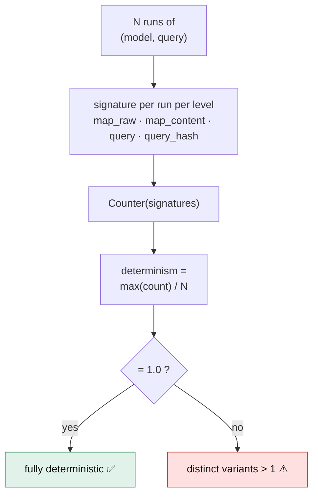

- `canonical()` sorts keys and lists so ordering-only churn (LLM reshuffling a
  synonym list) doesn't count as non-determinism — isolating *real* intent drift
  (`map_content`) from cosmetic drift (`map_raw`).

## Reproducibility in practice: measured & fixed

We built a harness (originally `test.py`, now `eval/determinism_eval.py`) to *measure* determinism instead of assuming it: for each
`(model, query)` it runs the whole pipeline N times and scores agreement (see
algorithm F). Running it exposed that the naive design was essentially
non-deterministic, and drove three fixes.

### What we found (10 runs/query, `temperature=0`)

| Configuration | Typical `query_hash` determinism | Why |
|---|---|---|
| **baseline** (LLM freetext → query) | ~**0.10** (8/10 models) | LLM emits a different synonym list every run; only gemini-3.5-flash was naturally stable |
| **`--strict`** (freetext from MeSH entry terms) | 0.10 → **0.4–0.94** | removes freetext noise; ceiling = how stable the model's *heading choice* is |
| **`--strict --cache`** (+ pin the map) | **1.00** across all models | heading set no longer varies → query is a pure function of pinned descriptors |

The residual gap after `--strict --cache` (opus 0.85, deepseek 0.74) turned out
to be a **bug**, not model variance — see mechanism 3.

### The three mechanisms

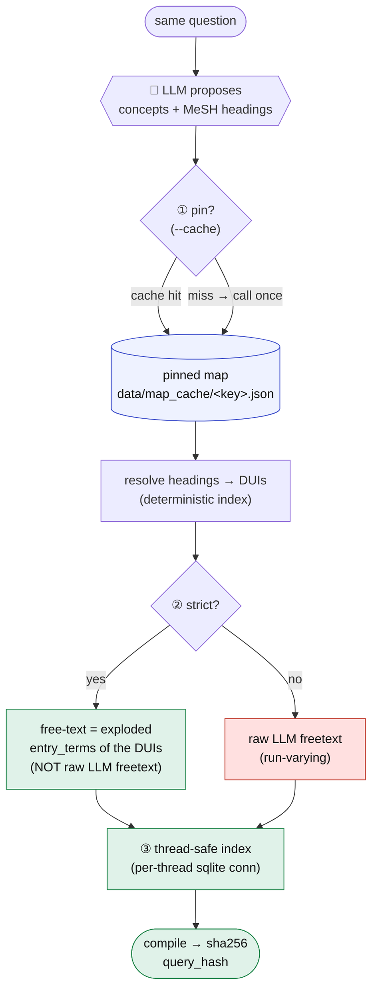

1. **Strict term derivation (`--strict`, and the app's "Strict MeSH synonyms"
   toggle).** Use the LLM *only* to pick MeSH headings; derive free-text from the
   deterministic index, so the query is a pure function of the chosen DUIs — no
   run-varying LLM prose enters it. **Descendant mapping is intelligent:** the
   `"Heading"[MeSH Terms]` tag already auto-explodes the whole descendant
   hierarchy for indexed articles *server-side, at zero query length*, so we do
   **not** enumerate every descendant's synonyms (that produced 3000-term,
   URL-breaking queries). Free-text is a **bounded** set — each heading's own
   lexical variants first, then descendant variants only while under a budget
   (`STRICT_MAX_TERMS`, default 60/concept) — enough to catch not-yet-indexed
   records while keeping the query compact (≈5 KB, usable in PubMed's own search
   box). Deterministic via sorted, stable truncation (`MeshIndex.strict_terms`).

2. **Map pinning (`--cache`).** A fresh LLM call is inherently non-deterministic
   in *which* headings it returns. Pinning runs the map **once** per
   `(model, question, domains)`, persists it, and reuses it — so the same
   question always yields the same headings. This mirrors the app's existing
   `protocol.json`: the reproducibility unit is the **saved mapping**, not a
   re-invoked LLM. Combined with `--strict` → `query_hash == 1.00`.

3. **Thread-safe MeSH index (bug fix).** `MeshIndex` shared one SQLite
   connection across threads; concurrent `entry_terms` lookups corrupted each
   other → occasionally a wrong term set (or `sqlite3.InterfaceError`). That was
   the last 0.85/0.74 wobble, and it affected the **production app** too (FastAPI
   serves concurrent requests). Fixed with per-thread connections
   (`threading.local`); 120 concurrent lookups now return one identical result.

### Model-agnostic: cloud + local open-source

The map step speaks the OpenAI chat-completions shape, so the client routes by
model-id prefix — no code change to swap providers:

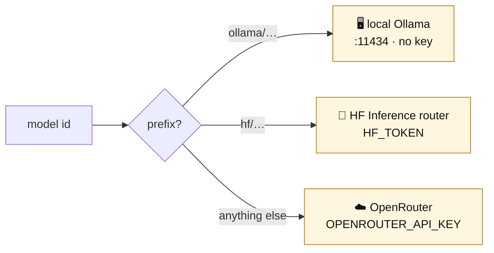

Because `--strict` sources terms from MeSH, even a tiny local model works: a 1B
`ollama/llama3.2:1b` writes poor free-text (full sentences), but that is
discarded — it only needs to *name* MeSH-resolvable concepts, and the
deterministic layer supplies exhaustive, reproducible synonyms.

## Cross-model determinism: three strategies (2026-08-10)

The first evaluation (`data/baseline_2026-07-15/`) measured two different things and only one of them was good:

| | what it means | baseline result |
|---|---|---|
| **within-model** | same model, rerun → same query | 1.00 — but **with `--cache`**, which pins the LLM output, so it was true by construction |
| **cross-model** | different models, same question → same query | **0.09** — 11 models produced 11 distinct queries |

Cross-model agreement matters because it decides what a protocol has to record.
At 0.09, "we searched PubMed with this question" is not a reproducible method;
only "…with this question, this model, this strategy" is.

### Why the queries differed

Replaying the 33 archived proposals (`eval/replay_baseline.py`, prompt v1 held
fixed) through each new deterministic rule separates cosmetic divergence from real
disagreement:

| stage | cross-model | heading Jaccard |
|---|---|---|
| legacy (fuzzy resolution, no pruning, model's block order) | 0.09 | 0.23 |
| exact-only resolution | 0.09 | 0.24 |
| + subsumption pruning | 0.09 | 0.24 |
| + canonical ordering (**the new deterministic layer in full**) | 0.09 | 0.24 |

The layer does what it claims — `Hippocampus + CA1 + CA3 + Dentate Gyrus +
Entorhinal Cortex` collapses to `Entorhinal Cortex + Hippocampus`, `Mice`/`Rats`
collapse into `Rodentia`, blocks come out in a fixed order — **and it moves
cross-model agreement not at all.** The divergence was never formatting: with a
free-form prompt the models pick genuinely different heading *sets* (claude
`Disease Models, Animal + Mice, Transgenic + Rodentia`, gemini `Models, Animal +
Rodentia`, gpt `Animals, Laboratory + Rodentia`) and different numbers of facets
(1 to 7 blocks for one question). Canonicalisation is **necessary but not
sufficient**: it is what lets two *agreeing* selections come out byte-identical.

So the fix has to shrink what the model is allowed to choose. Hence three
strategies, selectable per search (`mode` on `/api/map`).

### Measured (live, 7 models × 3 questions × 3 runs, cache OFF, strict ON)

`data/determinism_v3.json`, rendered in `data/determinism_v3.png`, tabulated with
column definitions in `data/determinism_v3.md`:

| strategy | within-model | cross-model | heading Jaccard | block-count agr. | **PMID Jaccard** | median hit-count spread |
|---|---|---|---|---|---|---|
| `llm` / prompt v1 (the old prompt) | 0.57 | 0.14 | 0.25 | 0.62 | 0.27 | 51,605 |
| `llm` / prompt v2 | 0.71 | 0.24 | 0.47 | 0.57 | 0.18 | 16,765 |
| `hybrid`, model picks the synonyms | 0.75 | 0.52 | 0.74 | 0.76 | – | – |
| `hybrid`, derived synonyms (**default**) | 0.90 | **0.76** | 0.95 | 0.76 | **0.68** | 348 |
| `mesh_only` | 1.00 | 1.00 | 1.00 | 1.00 | 1.00\* | 0 |

\* `mesh_only` produces one query for everybody, so its overlap is 1.00 by
construction — there are no pairs to measure. The PMID Jaccard column is measured on
**complete** result sets (see the note on NCBI's 9,999-record ceiling below).

Read it with the floor in mind: with 7 models a chance-level modal share is
1/7 = **0.14**, which is exactly where `llm/v1` sits — the same place the original
11-model run's 0.09 (floor 0.09) sat. Against that floor:

- **Prompt v2's gains are mostly not in byte agreement.** Same-model reproducibility
  0.57 → 0.71 and heading overlap 0.25 → 0.47, but cross-model only 0.14 → 0.24.
  Its sharpest effect is on hallucination: headings that failed exact resolution
  fell from **104 to 5**, and the median query shrank from 7.7 KB to 3.8 KB — the v1
  queries were flirting with PubMed's ~8 KB URL limit. A better prompt cannot make
  two models agree; it can only stop one model contradicting itself.
- **Hybrid + the three canonicalisations is what moves cross-model**: 0.14 → 0.76,
  heading overlap 0.25 → 0.95, retrieved-corpus overlap 0.26 → 0.68, hit-count
  spread 51,605 → 348. The `model picks the synonyms` row is the ablation: it is the
  same selections with the derivation switched off, and it drops to 0.52.
- Across every run, models cited **zero** ids outside the slate and **zero** headings
  failed to resolve — the closed set holds, so hallucination is not merely filtered,
  it is unrepresentable.
- **`mesh_only` is 1.00 on every metric**, including PMID Jaccard, because no model
  is involved. That is the ceiling for portability and the floor for judgement.

**Run-to-run variance is real at this sample size.** An identical-configuration
hybrid-only run immediately before this one scored cross-model **0.90**, heading
Jaccard 0.95, PMID Jaccard 0.87 (`data/logs/hybrid_only_run_2026-08-10.log`), versus
0.76 / 0.95 / 0.68 here. Three questions × seven models is 21 observations per cell,
so treat single-decimal differences as noise and read hybrid as **≈0.8**. The
`llm`-vs-`hybrid` gap (0.14–0.24 vs 0.76–0.90) is far outside that noise; the
`v1`-vs-`v2` PMID Jaccard comparison is well inside it and should not be quoted.

What remains is genuine judgement disagreement, not machinery: on the optogenetics
question one model does not treat `Hippocampus` as a required facet, and on the
CRISPR question one model omits the non-MeSH jargon facet. Those are the arguments
two human specialists would also have.

Practical guidance: if the protocol must be reproducible by another lab with a
different model, use `mesh_only`, or `hybrid` **and record the model**. Within one
lab, `hybrid` at 0.90 with a saved `protocol.json` is reproducible in the way that
matters — the protocol pins the selection, not the model's mood.

There were **zero** hard failures across ~600 live runs (no unparseable JSON, no
HTTP errors), from claude-opus-4.8 down to llama-3.1-8b.

### The three things that had to stop being the model's decision

Each was found by asking *why* two models with the same intent still produced
different queries, and each is a pure function of the question plus the index:

| leak | symptom | fix |
|---|---|---|
| **grouping** | two models picked the identical four headings, one ORed `Optogenetics` with `Hippocampus` | `candidates.span_groups` — overlapping question words are one OR block |
| **synonym choice inside a facet** | seven models named five different subsets of `{CRISPR-Cas Systems, Clustered Regularly Interspaced…, RNA, Guide, CRISPR-Cas Systems}` — one OR block, so it barely changed retrieval and changed every byte | `candidates.group_closure` — naming any member selects the facet's canonical vocabulary |
| **prose reaching the query** | identical headings compiled to 153 vs 145 terms, because block *names* and model free-text fired different domain-vocab clusters; and the free-text-only jargon block was pure model prose (`off target`, `off-targets`, `bioinformatics`, `machine learning`, `method*`) | strict mode matches vocabulary against headings only, and the jargon block is rebuilt from the question's own unresolved phrases |

The trade-off in the third row is explicit: the model's own jargon ("GUIDE-seq",
"unintended editing") no longer reaches the query in strict mode. What survives is
the question's unresolved wording plus whatever `data/domain_terms.json` supplies —
both reproducible, both editable by the reviewer, neither dependent on which model
was called.

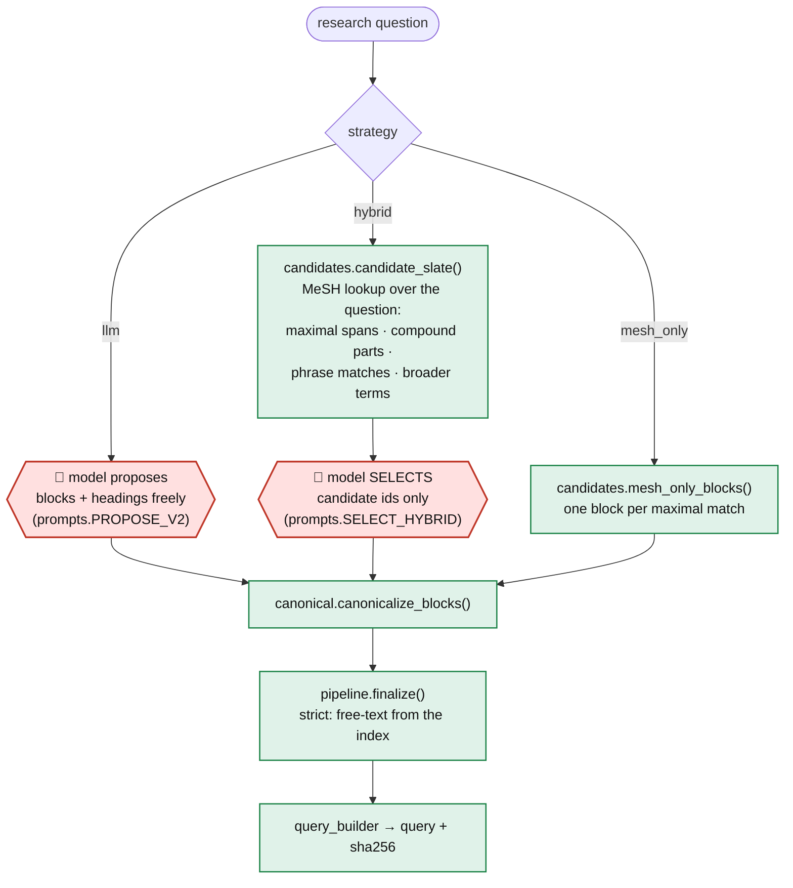

- **`llm`** — the original design with prompt **v2**. Every rule in
  `prompts.PROPOSE_V2` traces to an observed failure: a 2–4 block budget and an
  explicit ban-list (study design, statistics, "Computational Biology", a parent
  category of another block) against invented facets; "give the BROADEST heading
  and never its narrower ones" against redundant sets; "if you are unsure of the
  exact string, put it in free-text" against hallucinated headings that used to be
  fuzzy-matched into something wrong; a worked example, because a shared example
  is the cheapest way to make two models answer alike.
- **`hybrid`** — the deterministic index proposes, the model only *picks*. The
  slate is a pure function of (question, MeSH index), the model returns ids, and
  an id outside the slate is discarded. A heading the question does not lexically
  reach **cannot enter the query**, so hallucination is structurally impossible and
  the model's whole output space is enumerable. This is the mode to use when
  cross-lab portability matters.
- **`mesh_only`** — no LLM: every maximal MeSH match becomes a block.
  Model-independent by construction (agreement 1.00), and the fallback whenever the
  hybrid selection call fails or comes back empty. It has no judgement: it cannot
  drop an irrelevant lexical match or add a facet the question only implies.

### Who decides what is ORed

Selecting the same headings is not enough. Two models chose the *identical* four
headings for the optogenetics question and still compiled different queries: one
ANDed all four, the other ORed `Optogenetics` with `Hippocampus` — which is also
simply wrong, since a technique and a brain region are not alternatives.

Grouping is a property of the **question**, not of the model, so hybrid mode takes
that decision back (`candidates.span_groups`): candidates whose source word-spans
overlap are alternatives for one facet and go in one OR block; candidates from
disjoint spans stay ANDed. A broader term inherits its child's span, so
`Limbic System` lands beside `Hippocampus`.

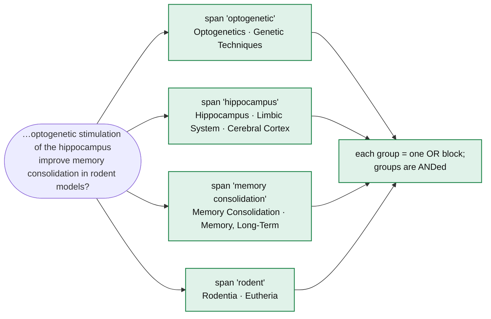

So the division of labour is: **the model picks vocabulary, the question picks
structure.** The model's slot label, block name and free-text follow its ids into
whichever group they land in.

Caveat: a question that *enumerates* alternatives in separate words ("in mice and
rats") gets them ANDed, because their spans are disjoint. `mesh_only` has always
had this property; in hybrid it is visible in the review step, where merging the
two blocks is one click.

### What the slate does that plain lookup does not

`candidates.py` is the part that decides whether the closed set is any good:

| pass | example | why |
|---|---|---|
| maximal spans, longest-match-first | "memory consolidation" → `Memory Consolidation` (not `Memory` + something) | the question's own words, exact |
| singular/plural + hyphen variants | "rodent" → `Rodentia`, "Alzheimer's disease" → `Alzheimer Disease` | MeSH stores one surface form |
| compound splitting (digit/capital only) | `CRISPR-Cas9` → `CRISPR` | technical compounds are never verbatim MeSH |
| phrase pass: 3-char LIKE prefilter, then per-word prefix/abbreviation check | "single-cell RNA sequencing" → `Single-Cell Gene Expression Analysis` (via the entry term "Single-Cell RNA-Seq") | the same idea worded differently; the verification step is what keeps `optically ≠ optogenetic` and drops "Hip Prosthesis Implantation" for "hippocampus improve" |
| immediate broader terms | `Hippocampus` → `Limbic System` | gives the model a way to widen a facet without writing vocabulary |
| stop/generic word list | "methods", "detection", "effects" never become blocks | several are real headings (`Models, Theoretical` has the entry term "model"), and ANDing one throttles recall to near zero |

Unmatched content words are handed to the model as "UNMATCHED PHRASES" and may
only become **free-text** — that is how `off-target`, `scRNA-seq` and other jargon
MeSH lacks still reach the query.

### Reading the reproducibility numbers honestly

- Within-model determinism must be measured with the map cache **off**
  (`eval/determinism_eval.py` defaults to off). With `--cache` the answer is 1.00
  by definition and says nothing about the model.
- Cross-model agreement < 1.0 is not a bug per se — two specialists also disagree.
  The question is how much of the disagreement is *ours*. The ablation above says:
  with a free prompt, almost none of it.
- Byte agreement is the strict view. `heading Jaccard` (semantic overlap of chosen
  headings) and, with `--retrieval`, `pmid_jaccard` (overlap of what PubMed
  actually returns) are the views a reviewer should care about: two different
  strings can retrieve the same corpus.
- Therefore `protocol.json` records **question + model + mode + strict**, not just
  the query hash.

## Glossary

Every example below is real output from this repo, using `Hippocampus` as the
running case.

### MeSH vocabulary (NLM's terms)

- **Descriptor / heading** — the unit of MeSH: one concept with one official name.
  `Hippocampus` is a descriptor. Its name is what PubMed matches when you write
  `"Hippocampus"[MeSH Terms]`.
- **DUI (Descriptor Unique Identifier)** — MeSH's stable id for a descriptor, always
  `D` + digits: `Hippocampus` is **`D006624`**. Names get revised between MeSH
  editions; DUIs do not, which is why this codebase resolves to a DUI first and
  treats the label as a rendering of it. The `descriptor` table is keyed on it.
- **Entry term** — a synonym or lexical variant of a descriptor. `D006624` carries
  17: `Ammon Horn`, `Ammon's Horn`, `Cornu Ammonis`, `Hippocampal Formation`,
  `Subiculum`, `Hippocampus Proper`, plus inverted forms like
  `Formation, Hippocampal`. These become the `[Title/Abstract]` half of a block —
  they are how the search reaches papers PubMed has not indexed yet.
- **Tree number** — the descriptor's position in the MeSH hierarchy, as a dotted
  path. `Hippocampus` has two: `A08.186.211.180.405` and
  `A08.186.211.200.885.287.500.345` (a descriptor can sit in several places at
  once). The letter is the top-level category — `A` anatomy, `C` diseases, `D`
  chemicals, `G` phenomena.
- **Explosion** — retrieving a heading *plus everything beneath it in the tree*.
  Because the hierarchy is encoded in the dotted path, descendants are exactly the
  rows whose tree number is prefixed by the parent's, so this is a string-prefix
  query, not a graph traversal. `Hippocampus` explodes to 8 descriptors including
  `Dentate Gyrus`, `CA1 Region, Hippocampal` and `Schaffer Collaterals`.
- **Parents / broader terms** — one tree level up: `Hippocampus` → `Cerebral Cortex`,
  `Limbic System`.
- **`[MeSH Terms]`** — PubMed's field tag for a heading search. It **auto-explodes**:
  the descendants come for free, server-side, at zero query length. This is why
  listing `Hippocampus` *and* `Dentate Gyrus` in one block is pure redundancy —
  and why this tool prunes it.
- **`[MeSH:NoExp]`** — the same search with explosion suppressed (this tool emits it
  when you untick *Explode* on a block).
- **`[Title/Abstract]`** — free-text search of title and abstract only. Catches
  records that are too new to be MeSH-indexed, at the cost of precision.
- **`[Date - Publication]`** (PDAT) — the field the retrieval layer slices on to get
  past NCBI's 9,999-record ceiling.
- **PMID** — PubMed's record id. The de-duplication key and sort key for results.

### Terms this design introduces

- **Facet / concept block** — one requirement the question makes, rendered as one
  parenthesised group: MeSH headings ORed with free-text terms. Blocks are ANDed, so
  every block must be satisfied. "Hippocampus" is one facet of the example question;
  "rodent models" is another.
- **Slot** — the facet's PICO-ish label (`population`, `intervention`, `comparator`,
  `outcome`, `method`, `context`). Useful for display and review. Deliberately *not*
  used to order or merge blocks: models label identical content with different slots,
  so it is the least reliable field in the response.
- **Candidate slate** — the numbered list of real MeSH descriptors found in the
  question by `candidates.candidate_slate()`, before any model sees it. In `hybrid`
  mode this is the model's entire universe: an id outside it is discarded, so
  hallucinated vocabulary is not filtered out — it is unrepresentable.
- **Relation** — how a candidate was found. **`exact`**: the question's own words
  matched a heading or entry term (`hippocampus` → `Hippocampus`). **`phrase`**: MeSH
  words the same idea differently ("single-cell RNA sequencing" →
  `Single-Cell Gene Expression Analysis`, via its entry term `Single-Cell RNA-Seq`).
  **`broader`**: one tree level above an exact match (`Hippocampus` →
  `Limbic System`).
- **Span group** — the set of candidates whose source words in the question overlap.
  These are alternatives for one facet, so they become one OR block; candidates from
  disjoint words stay ANDed. This takes the grouping decision away from the model,
  which is the decision it is least consistent about.
- **Facet closure** — given that the model chose a facet, the *vocabulary* of that
  facet is derived rather than chosen: every `exact` candidate in the group, plus
  `phrase` candidates at least as well-supported as the exact one. So naming
  `Limbic System` yields `Hippocampus`, and naming any one of three near-synonymous
  CRISPR descriptors yields all three.
- **Subsumption pruning** — dropping a heading that another heading in the same block
  already explodes over. `Hippocampus + CA1 Region + Dentate Gyrus` → `Hippocampus`:
  identical retrieval, one canonical string.
- **Strict mode** — derive each block's free-text from the MeSH index instead of the
  model's prose (the app's *Strict MeSH synonyms* checkbox, on by default). It is the
  difference between a query that is a function of your selections and one that is a
  function of which model you called.
- **Query hash** — `sha256(query)[:16]`, e.g. `a4dc7474caa9b4b4`. Two searches with
  the same hash are the same search, byte for byte.

### Evaluation vocabulary

- **within-model determinism** — one model, one question, N runs: the share of runs
  producing the byte-identical query. Must be measured with the map cache **off**;
  with it on the answer is 1.00 by construction.
- **cross-model determinism** — different models, same question: the share producing
  the byte-identical query (the *modal share* — how often the single most common
  answer recurs). **Chance level is 1/number-of-models**, so 0.14 at seven models and
  0.09 at eleven; the number is meaningless without that denominator and does not
  compare across runs of different size.
- **Jaccard index** — overlap of two sets: |A∩B| / |A∪B|. Applied to chosen MeSH
  headings (**heading Jaccard** — did the models agree on substance, ignoring
  formatting?) and to the PMIDs PubMed returns (**PMID Jaccard** — did the queries
  retrieve the same papers?). 1.00 = identical.
- **hit-count spread** — largest minus smallest PubMed hit count across models. An
  absolute-scale companion to PMID Jaccard: a spread of 51,605 means one model's
  query was wildly broader than another's.

### NCBI E-utilities

- **`esearch` / `efetch`** — search for ids / fetch records.
- **`WebEnv` + `query_key`** — the history server's handle to a stored result set, so
  `efetch` can page through it without resending the query.
- **`retstart` / `retmax`** — paging offset and page size. `retstart > 9998` is
  refused for PubMed, which is the ceiling the date-slicing exists to work around.
- **EDirect** — NCBI's own command-line tools, which batch large PubMed result sets
  automatically. `date_partitions()` is this tool's equivalent of that logic.

## Legend

| Color | Meaning |
|-------|---------|
| 🔴 red | non-deterministic (LLM proposal only) |
| 🟢 green | deterministic backend logic |
| 🔵 blue | data stores / artifacts |
| 🟠 orange | external service (NCBI) |
| 🟣 purple | user / UI |
