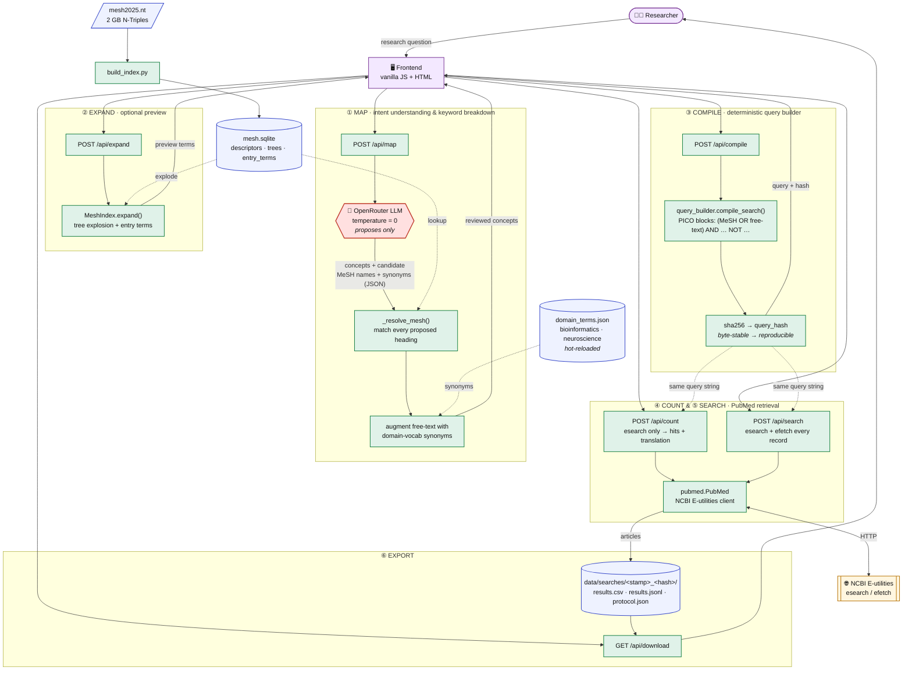
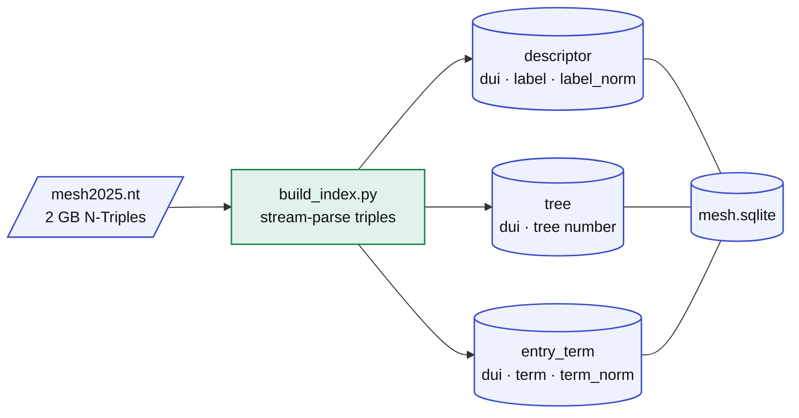
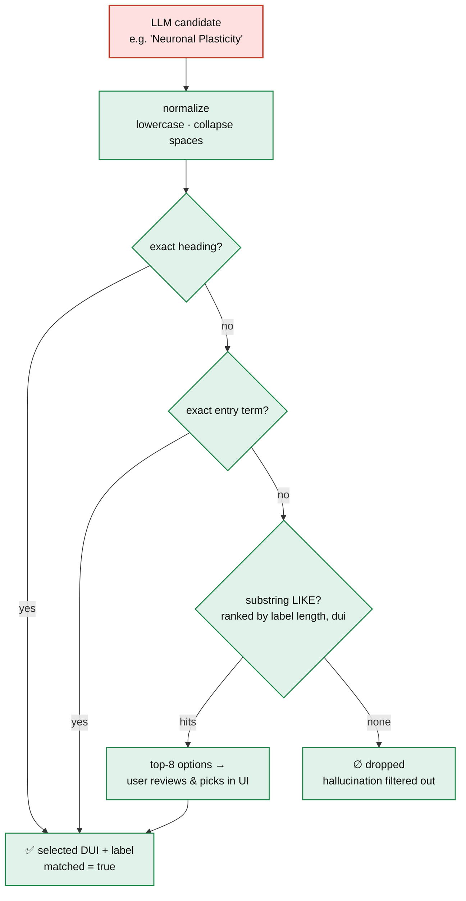
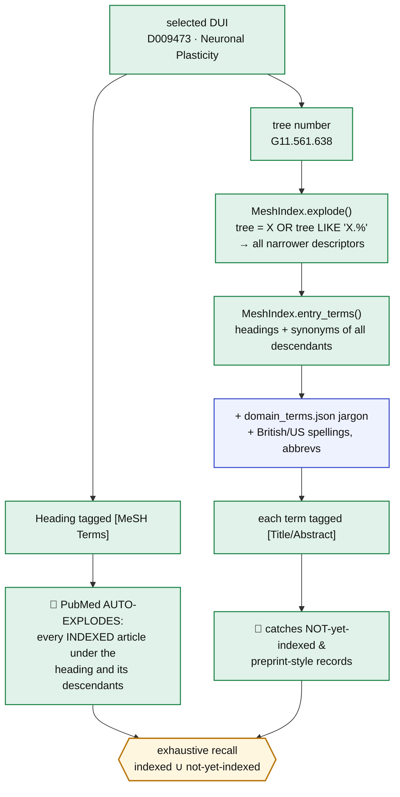
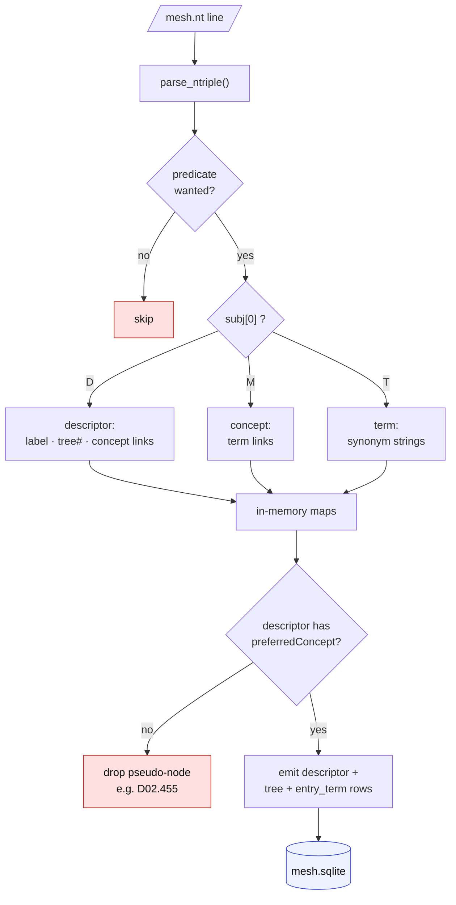
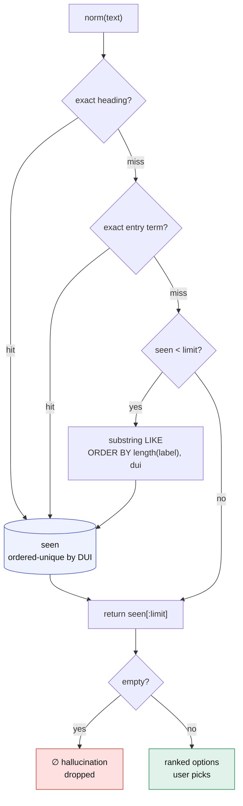
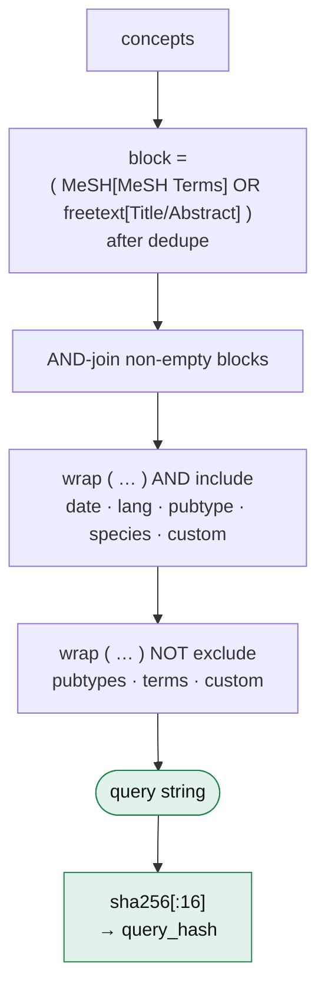
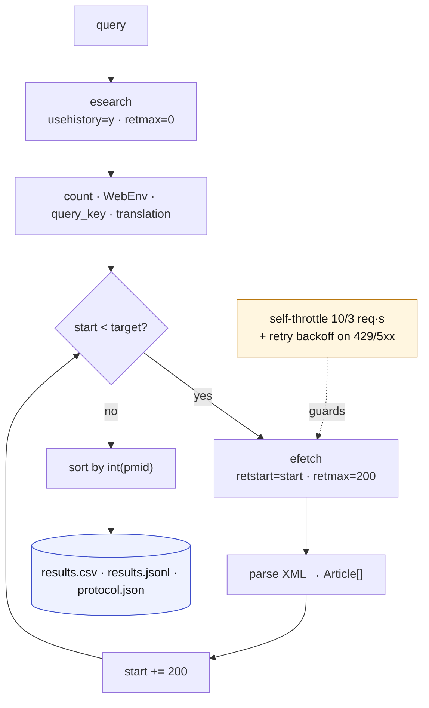
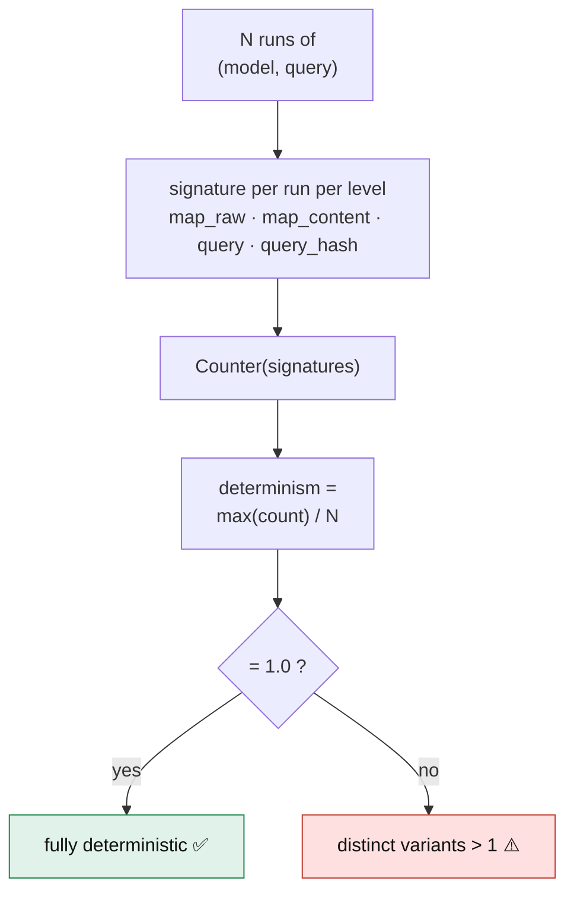
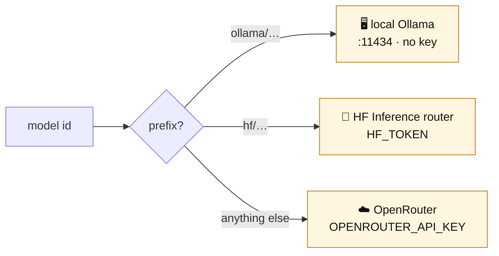

# Deterministic PubMed Search — Architecture

How an exhaustive, **reproducible** literature search is built. The core idea:
the LLM is the *only* non-deterministic component and it merely **proposes**
structure — every proposal is resolved against a local, deterministic MeSH index
before it can affect the query. So the same question always compiles to the same
byte-identical PubMed query (and hash).



## The determinism boundary


**How far this holds — and where it breaks.** The deterministic layer does real
work: a hallucinated MeSH heading resolves to *nothing* and drops out; terms are
lower-cased, de-duped, sorted; block/clause order is fixed. But we *measured* it
(`test.py`, 10 models × 10 runs) and the naive pipeline is **not** reproducible:
`query_hash` determinism was ≈ **0.10** for most models (all 10 runs → 10
different queries). At `temperature=0` the LLM still emits a **different set of
free-text synonyms — and even a different set of MeSH headings — each run**, and
those flow straight into the query. The deterministic layer can't absorb a
changing *input set*. See **[Reproducibility in practice](#reproducibility-in-practice-measured--fixed)**
for the numbers and the three mechanisms that actually get it to 1.00.

## How MeSH is used

MeSH (Medical Subject Headings) is NLM's controlled vocabulary. It does two jobs
here: it **filters LLM hallucinations** (a proposed heading that isn't real
resolves to nothing) and it **drives exhaustive recall** (tree explosion + entry
terms). All of it is local and deterministic.

### 1 · Building the index (one-time, offline)

`mesh2025.nt` (2 GB N-Triples) is distilled into a small SQLite DB. Only
subjects that carry a `preferredConcept` are kept as descriptors — that filters
out tree-number nodes that share the `D…` prefix but aren't real headings.



| Table | Columns | Purpose |
|-------|---------|---------|
| `descriptor` | `dui`, `label`, `label_norm` | the official heading (D-unique-id) |
| `tree` | `dui`, `tree` | hierarchy positions (e.g. `G11.427.590`) → explosion |
| `entry_term` | `dui`, `term`, `term_norm` | synonyms / variants → free-text recall |

### 2 · Resolving an LLM-proposed heading (`_resolve_mesh` → `MeshIndex.search`)

Each candidate name from the LLM is normalized then matched in a fixed priority
order. A name that matches nothing simply **drops out** — that is the
hallucination filter.



### 3 · Explosion + entry terms = exhaustive recall

The selected descriptor feeds two complementary recall paths that are ORed
inside its concept block:



**The key insight:** `[MeSH Terms]` alone only finds articles NLM has already
manually indexed — which lags months behind publication and misses preprints. By
also injecting the exploded descendants' **entry terms** (plus domain jargon) as
`[Title/Abstract]`, the query reaches recent and not-yet-indexed records too.
That union is the "exhaustive" part, and because both halves come from the
deterministic index, the result is fully reproducible.

## Core algorithms

The system is a chain of small, deterministic algorithms wrapped around a single
LLM proposal step. Each one below is taken directly from the code.

### A · Index build — streaming N-Triples → SQLite  (`build_index.py`)

MeSH RDF is a 2 GB flat triple file; loading it into an RDF library is
unnecessary. Instead we stream it line-by-line and route each triple by the
**first letter of its subject** (`D`escriptor / `M` concept / `T` term),
reconstructing the `descriptor → concept → term → label` chain in memory, then
flushing to SQLite.

```text
for each line in mesh.nt:                       # ~ tens of millions, O(1) mem/line
    (subj, pred, obj, is_uri) = parse_ntriple(line)   # hand-rolled, no rdflib
    skip unless pred ∈ {label, treeNumber, concept, preferredConcept,
                        term, preferredTerm, prefLabel, altLabel}
    switch subj[0]:
        'D': record label / tree numbers / concept links for the descriptor
        'M': record term links for the concept
        'T': record synonym strings for the term

for each descriptor D with a (preferred) Concept:      # ← the key filter
    emit descriptor(D.dui, label, norm(label))
    emit tree(D.dui, t)            for t in D.tree_numbers
    synonyms = {D.label} ∪ {labels of every term of every concept of D}
    emit entry_term(D.dui, s, norm(s))  for s in synonyms
```



- **Why the "has a concept" filter?** Category-D tree nodes (e.g. `D02.455`) are
  also `D`-prefixed and carry an `rdfs:label`, but no `preferredConcept`.
  Requiring a concept drops those pseudo-descriptors — the gotcha that made
  early builds noisy.
- `norm(s)` = lowercase + whitespace-collapse, stored alongside the raw string
  so lookups are case/spacing-insensitive but display stays exact.

### B · Candidate resolution ladder  (`MeshIndex.search`)

Turns a free-text LLM suggestion into real descriptors via a fixed-priority
cascade; stops widening once it has enough. This is both the fuzzy matcher and
the hallucination filter.

```text
resolve(text, limit=8):
    seen = ordered-unique-by-DUI
    add  exact heading      WHERE label_norm = norm(text)          # tier 1
    add  exact entry term   WHERE term_norm  = norm(text)          # tier 2
    if |seen| < limit:
        add substring        WHERE label_norm LIKE '%norm(text)%'  # tier 3
             ORDER BY length(label), dui   LIMIT limit             # shortest first
    return seen[:limit]        #  ∅  ⇒ candidate was a hallucination, dropped
```



- Ordering is total and deterministic (`length(label), dui`), so the same
  suggestion always yields the same ranked options — no tie-break ambiguity.

### C · Tree explosion — dotted-prefix set union  (`MeshIndex.explode`)

MeSH "explode" = a heading plus everything hierarchically beneath it. Tree
numbers encode the hierarchy as dotted paths (`G11.561.638`), so descendants are
exactly the rows whose tree number equals or is prefixed by one of the seed's:

```text
explode(dui):
    found = {dui}
    for tn in tree_numbers(dui):
        found ∪= { d : tree(d) = tn  OR  tree(d) LIKE tn || '.%' }
    return sorted(found)          # stable
```


- Purely relational; no recursion needed because the dotted path *is* the
  ancestry. `A01` → `A01`, `A01.111`, `A01.923.047`, …

### D · Deterministic query compilation + hash  (`query_builder`)

Concept blocks compile to a canonical Boolean string. Determinism comes from:
order-preserving case-insensitive de-dup, fixed clause order, and consistent
quoting.

```text
block(concept)  = "(" + OR_join(
                      [ q(h)+MeSH-tag       for h in dedupe(concept.mesh) ] +
                      [ q(t)+"[Title/Abstract]" for t in dedupe(concept.freetext) ]
                  ) + ")"

query = AND_join(non-empty blocks)                       # PICO: blocks ANDed
for clause in [date, languages, pub-types, species, custom_include]:
    query = "(query) AND clause"                         # inclusion filters
for clause in [exclude pub-types, exclude terms, custom_exclude]:
    query = "(query) NOT clause"                         # exclusions
hash  = sha256(query)[:16]                               # reproducibility key
```



- `dedupe` keeps first occurrence, compares on `strip().lower()` → stable set,
  stable order. Same inputs ⇒ byte-identical `query` ⇒ identical `hash`. This is
  the invariant `test.py` measures as `query_hash` determinism.

### E · Exhaustive retrieval — history server + paging  (`pubmed.PubMed`)

To pull *every* match with no silent cap, we use the E-utilities history server:
one `esearch` stores the full result set server-side (`WebEnv` + `query_key`),
then `efetch` pages through it.

```text
search(query):  esearch(usehistory=y, retmax=0) → {count, WebEnv, query_key, translation}

fetch_all(WebEnv, query_key, count):
    target = min(count, max_records?)          # cap only if caller sets one
    for start in 0, 200, 400, … < target:      # batches of 200
        xml = efetch(WebEnv, query_key, retstart=start, retmax=200)
        articles += parse(xml)
    return sort(articles, key=int(pmid))        # stable order regardless of NCBI paging
```



- **Self-throttle** to NCBI limits (10 req/s with key, else 3) and **retry with
  linear backoff** on 429/5xx. Result order is normalized by PMID so two runs
  produce identical files.

### F · Determinism scoring  (`test.py`)

For each `(model, query)` we run the pipeline `N` times and score agreement at
four levels. The score is the **modal frequency** — how often the single most
common output recurs:

```text
signature(run, level) = { map_raw:     json(map, order-preserved),
                          map_content: canonical(map),     # keys+lists sorted
                          query:       compiled query string,
                          query_hash:  sha256(query) }[level]

determinism(level) = max(count(sig)) / N        #  1.0 ⇔ every run identical
```



- `canonical()` sorts keys and lists so ordering-only churn (LLM reshuffling a
  synonym list) doesn't count as non-determinism — isolating *real* intent drift
  (`map_content`) from cosmetic drift (`map_raw`).

## Reproducibility in practice: measured & fixed

We built `test.py` to *measure* determinism instead of assuming it: for each
`(model, query)` it runs the whole pipeline N times and scores agreement (see
algorithm F). Running it exposed that the naive design was essentially
non-deterministic, and drove three fixes.

### What we found (10 runs/query, `temperature=0`)

| Configuration | Typical `query_hash` determinism | Why |
|---|---|---|
| **baseline** (LLM freetext → query) | ~**0.10** (8/10 models) | LLM emits a different synonym list every run; only gemini-3.5-flash was naturally stable |
| **`--strict`** (freetext from MeSH entry terms) | 0.10 → **0.4–0.94** | removes freetext noise; ceiling = how stable the model's *heading choice* is |
| **`--strict --cache`** (+ pin the map) | **1.00** across all models | heading set no longer varies → query is a pure function of pinned descriptors |

The residual gap after `--strict --cache` (opus 0.85, deepseek 0.74) turned out
to be a **bug**, not model variance — see mechanism 3.

### The three mechanisms


1. **Strict term derivation (`--strict`, and the app's "Strict MeSH synonyms"
   toggle).** Use the LLM *only* to pick MeSH headings; derive free-text from the
   deterministic index, so the query is a pure function of the chosen DUIs — no
   run-varying LLM prose enters it. **Descendant mapping is intelligent:** the
   `"Heading"[MeSH Terms]` tag already auto-explodes the whole descendant
   hierarchy for indexed articles *server-side, at zero query length*, so we do
   **not** enumerate every descendant's synonyms (that produced 3000-term,
   URL-breaking queries). Free-text is a **bounded** set — each heading's own
   lexical variants first, then descendant variants only while under a budget
   (`STRICT_MAX_TERMS`, default 60/concept) — enough to catch not-yet-indexed
   records while keeping the query compact (≈5 KB, usable in PubMed's own search
   box). Deterministic via sorted, stable truncation (`MeshIndex.strict_terms`).

2. **Map pinning (`--cache`).** A fresh LLM call is inherently non-deterministic
   in *which* headings it returns. Pinning runs the map **once** per
   `(model, question, domains)`, persists it, and reuses it — so the same
   question always yields the same headings. This mirrors the app's existing
   `protocol.json`: the reproducibility unit is the **saved mapping**, not a
   re-invoked LLM. Combined with `--strict` → `query_hash == 1.00`.

3. **Thread-safe MeSH index (bug fix).** `MeshIndex` shared one SQLite
   connection across threads; concurrent `entry_terms` lookups corrupted each
   other → occasionally a wrong term set (or `sqlite3.InterfaceError`). That was
   the last 0.85/0.74 wobble, and it affected the **production app** too (FastAPI
   serves concurrent requests). Fixed with per-thread connections
   (`threading.local`); 120 concurrent lookups now return one identical result.

### Model-agnostic: cloud + local open-source

The map step speaks the OpenAI chat-completions shape, so the client routes by
model-id prefix — no code change to swap providers:



Because `--strict` sources terms from MeSH, even a tiny local model works: a 1B
`ollama/llama3.2:1b` writes poor free-text (full sentences), but that is
discarded — it only needs to *name* MeSH-resolvable concepts, and the
deterministic layer supplies exhaustive, reproducible synonyms.

## Legend

| Color | Meaning |
|-------|---------|
| 🔴 red | non-deterministic (LLM proposal only) |
| 🟢 green | deterministic backend logic |
| 🔵 blue | data stores / artifacts |
| 🟠 orange | external service (NCBI) |
| 🟣 purple | user / UI |
